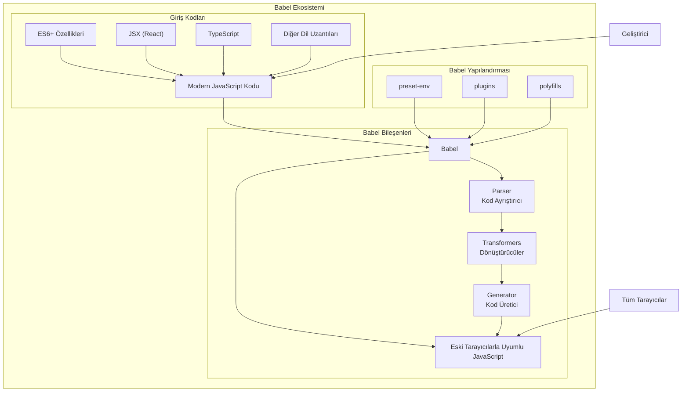

# Babel Nedir?

Babel, modern JavaScript kodunu (ES6+, TypeScript, JSX vb.) eski tarayıcıların anlayabileceği JavaScript versiyonlarına (genellikle ES5) dönüştüren bir JavaScript derleyicisidir (transpiler). Adını İncil'deki Babil Kulesi hikayesinden alır - farklı "dilleri" (JavaScript versiyonlarını) birbirine çevirme amacına atıfta bulunur.




## Babel'in Temel İşlevleri

1. **Kod Dönüştürme**: Modern JavaScript özelliklerini (arrow functions, destructuring, async/await vb.) eski JavaScript sürümlerine çevirir
2. **Sözdizimi Genişletmeleri**: JSX, TypeScript, Flow gibi JavaScript uzantılarını standart JavaScript'e dönüştürür
3. **Polyfill Desteği**: Yeni JavaScript API'lerini eski tarayıcılarda çalışabilir hale getirir
4. **Eklenti Sistemi**: Özelleştirilebilir dönüşümler için geniş bir eklenti ekosistemi sunar

## Babel'in Çalışma Mantığı

Babel, kodu üç ana aşamada işler:

1. **Parsing (Ayrıştırma)**: Kaynak kodu alır ve Abstract Syntax Tree (AST) adı verilen bir veri yapısına dönüştürür
2. **Transformation (Dönüştürme)**: AST'yi eklentiler ve presetler aracılığıyla değiştirir
3. **Generation (Üretim)**: Dönüştürülmüş AST'yi yeni JavaScript koduna çevirir


## Babel ve Webpack İlişkisi

Babel ve Webpack genellikle birlikte kullanılır ancak farklı amaçlara hizmet ederler:

| Babel | Webpack |
|-------|---------|
| Kod dönüştürücü (transpiler) | Modül paketleyici (bundler) |
| Modern JavaScript'i eski sürümlere çevirir | Farklı dosya türlerini paketler ve optimize eder |
| Sözdizimi dönüşümleri yapar | Bağımlılık yönetimi ve varlık optimizasyonu yapar |
| Tek bir dosya üzerinde çalışır | Tüm proje dosyalarını bir araya getirir |

Webpack içinde Babel, genellikle bir "loader" olarak kullanılır:

```javascript
// webpack.config.js örneği
module.exports = {
  module: {
    rules: [
      {
        test: /\.js$/,
        exclude: /node_modules/,
        use: {
          loader: 'babel-loader',
          options: {
            presets: ['@babel/preset-env']
          }
        }
      }
    ]
  }
};
```

## Babel'in Yaygın Kullanım Alanları

1. **React Geliştirme**: JSX sözdizimini standart JavaScript'e çevirmek için
2. **TypeScript Dönüşümü**: TypeScript kodunu JavaScript'e çevirmek için
3. **Modern JavaScript Kullanımı**: En yeni JavaScript özelliklerini kullanırken eski tarayıcı desteğini korumak için
4. **Polyfill Ekleme**: Yeni JavaScript API'lerini eski tarayıcılarda çalışır hale getirmek için

## Babel Yapılandırma Örnekleri

### Temel .babelrc Dosyası
```json
{
  "presets": ["@babel/preset-env"],
  "plugins": ["@babel/plugin-transform-runtime"]
}
```

### React ve TypeScript için Yapılandırma
```json
{
  "presets": [
    "@babel/preset-env",
    "@babel/preset-react",
    "@babel/preset-typescript"
  ]
}
```

Babel, modern web geliştirme süreçlerinde vazgeçilmez bir araçtır ve geliştiricilere en yeni JavaScript özelliklerini kullanma özgürlüğü sağlarken, kodlarının farklı tarayıcılarda çalışabilmesini garanti eder.