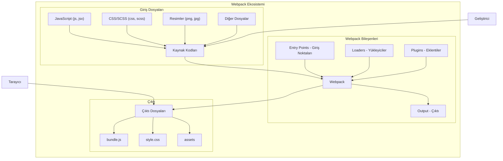

# webpack and babel

Webpack'in ne olduğunu ve nasıl çalıştığını bir UML diyagramı ile anlatmak istiyorum. Webpack, modern JavaScript uygulamaları için kullanılan bir modül paketleyicidir (module bundler).

````artifact
id: webpack-diagram
name: Webpack UML Diyagramı
type: mermaid
content: |-
  flowchart TB
    subgraph "Webpack Ekosistemi"
        A[Kaynak Kodları] --> B[Webpack]
        B --> C[Çıktı Dosyaları]
        
        subgraph "Giriş Dosyaları"
            A1[JavaScript (.js, .jsx)]
            A2[CSS/SCSS (.css, .scss)]
            A3[Resimler (.png, .jpg)]
            A4[Diğer Dosyalar]
            
            A1 --> A
            A2 --> A
            A3 --> A
            A4 --> A
        end
        
        subgraph "Webpack Bileşenleri"
            B1[Entry Points\nGiriş Noktaları]
            B2[Loaders\nYükleyiciler]
            B3[Plugins\nEklentiler]
            B4[Output\nÇıktı]
            
            B1 --> B
            B2 --> B
            B3 --> B
            B --> B4
        end
        
        subgraph "Çıktı"
            C1[bundle.js]
            C2[style.css]
            C3[assets/]
            
            C --> C1
            C --> C2
            C --> C3
        end
    end
    
    D[Tarayıcı] --> C
    E[Geliştirici] --> A
````

## Webpack Nedir?

Webpack, modern JavaScript uygulamalarında kullanılan güçlü bir modül paketleyicidir. Yukarıdaki UML diyagramı, Webpack'in temel çalışma prensibini göstermektedir.

### Webpack'in Temel Bileşenleri:

1. **Giriş Dosyaları (Input Files)**:
   - JavaScript/JSX dosyaları
   - CSS/SCSS dosyaları
   - Resimler ve diğer medya dosyaları
   - Diğer kaynak dosyaları

2. **Webpack'in Çekirdek Bileşenleri**:
   - **Entry Points (Giriş Noktaları)**: Webpack'in paketleme işlemine başlayacağı dosyaları belirtir.
   - **Loaders (Yükleyiciler)**: Farklı dosya türlerini (CSS, resimler, TypeScript vb.) işleyebilmek için kullanılır.
   - **Plugins (Eklentiler)**: Çıktının optimize edilmesi, ortam değişkenlerinin yönetilmesi gibi ek işlevler sağlar.
   - **Output (Çıktı)**: Paketlenmiş dosyaların nereye ve hangi formatta kaydedileceğini belirler.

3. **Çıktı Dosyaları (Output Files)**:
   - JavaScript bundle dosyaları (genellikle bundle.js)
   - CSS dosyaları
   - Optimize edilmiş resim ve diğer varlıklar

### Webpack'in Çalışma Mantığı:

1. Geliştirici, kaynak kodlarını yazar
2. Webpack, belirtilen giriş noktalarından başlayarak tüm bağımlılıkları analiz eder
3. Loaderlar aracılığıyla farklı dosya türlerini işler (örn. Babel ile JSX'i JavaScript'e dönüştürür
